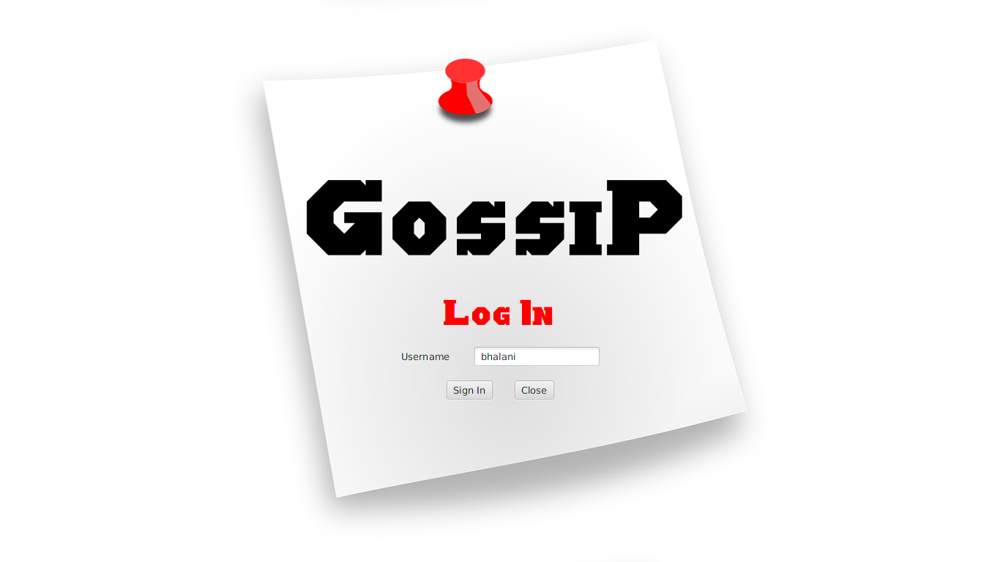
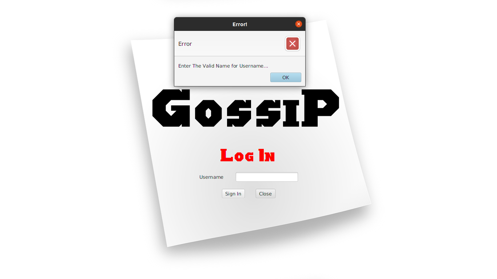
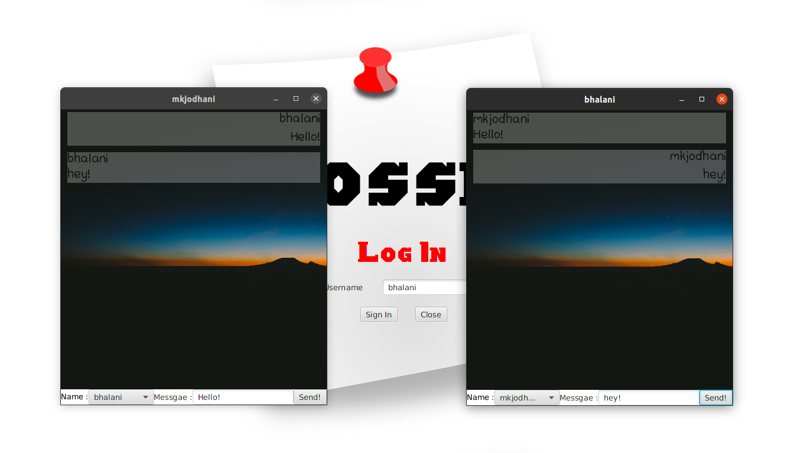

#  Gossip

## About / Synopsis

* Basic Chat-Application based on Socket Programming 
* Project status: working
* Windows Support

## Table of contents

> * [Gossip](#Gossip)
>   * [About / Synopsis](#about--synopsis)
>   * [Table of contents](#table-of-contents)
>   * [Installation](#installation)
>   * [Usage](#usage)
>     * [Screenshots](#screenshots)
>     * [Features](#features)
>   * [Code](#code)
>     * [Content](#content)
>     * [Requirements](#requirements)
>     * [Limitations](#limitations)
>     * [Run](#Run)
>   * [Resources (Documentation and other links)](#resources-documentation-and-other-links)
>   * [Contributing / Reporting issues](#contributing--reporting-issues)
>   * [License](#license)
>   * [About Nuxeo](#about-nuxeo)

## Installation

* Clone this repository to your machine.
* From the command line: `cd Gossip_jar`
* From there run command: `java -jar Gossip.jar`

## Usage







### Features

We can exchange the text through simple text by entering text in textFeild.

### Content

Basic Client-Server environment is made by using Java programming language.

### Requirements

See [Java Development  Kit (JDK) 11](https://www.oracle.com/in/java/technologies/javase-jdk11-downloads.html)

### Limitations

- The User database in server side is still developing.

- There is none feature to store the history of chat.

- Anyone from users can message every other users.

### Run

```com
java -jar Gossip.jar
```

## About Gossip

The Gossip is Java Chat application  which will be launched from the command line. The Users can run on  computer from anywhere in internet, `e.g. Wide  Area Network (WAN)`.

There can be multiple users connect to a  server and they can chat to each other, unlike chat room user can see only the messages forwarded to him/her. There’s  private chat between  two users.

Before getting connected to the server, a user must provide his or her name to enter the Application. The currently active user's list will be displayed on the user's interactive window for simplicity.

Every user is will  be updated when a new user arrives and when a user has gone. 

And finally, the user will close the window to quit the chat. And server will automatically remove that user from the active users list.
