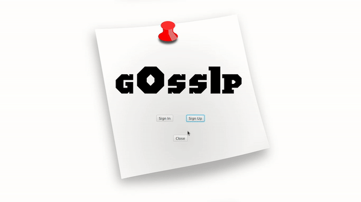

# Chat Application (GOSSIP)

## Main Commitment
### *App will provide basic features like,*
- Sign-Up
- Sign-In
- Send and Recieve Messages.
- Notify unseen messages.
- View Online Friends.

#### Start Date
January 31st, 2020.

## Additional Rules
1. First You have to Register your self through *GOSSIP*.
2. After that you can log in with valid username and password.
3. You will see list of your friends in the drop-down menu,there you can select to whom you want to talk with.
4. Type your message and press the *Send* Button.
5. After Closing the Chat-Window,you will automatically logged out from the system.

## Ideas to make this challenge more effective
1. To increase the chances of success, it's a requirement that you add a link to each of the day posts in the [log](log.md). It can be a link to a commit on GitHub, a link to a blog post
2. If you get upset or stuck, read this article: [Learning to Code: When It Gets Dark](https://www.freecodecamp.org/news/learning-to-code-when-it-gets-dark-e485edfb58fd/)
3. If you don't know why there is such an emphasis on working on the projects vs doing tutorials or online courses, read this: [How to Get a Developer Job in Less Than a Year](https://www.freecodecamp.org/news/how-to-get-a-developer-job-in-less-than-a-year-c27bbfe71645/)
4. If you can't push your code to GitHub for some reason (e.g. if you're only starting to code and doing interactive exercises), provide a link to a tweet. You can think of something else as long as your challenge stays public - and you get the benefit of being committed to it and accountable for your progress.
5. Another good bonus of forking this repo -> if you haven't worked with Markdown before, it's a good way to practice.

## Demo

